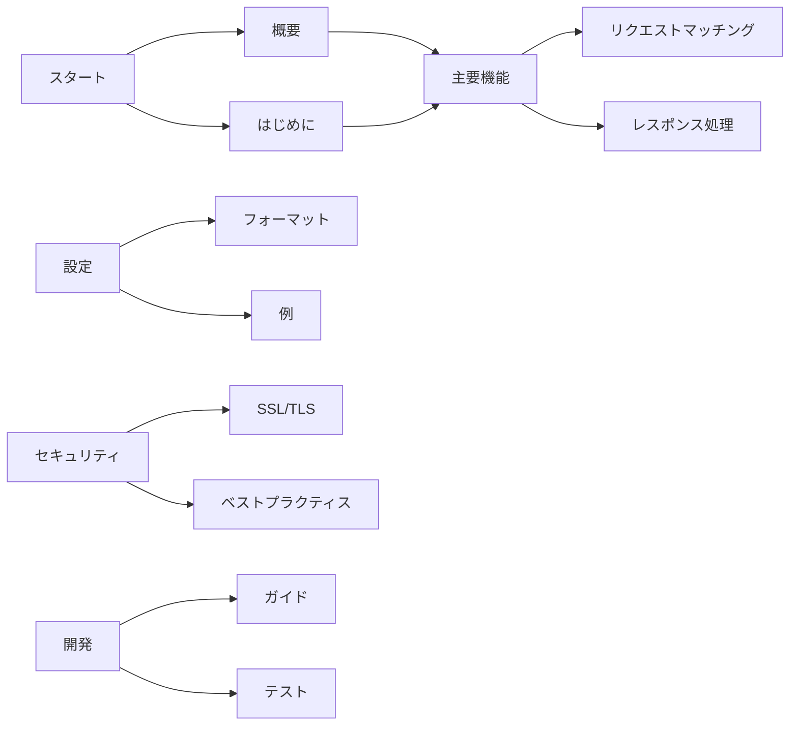

# GoStubby ドキュメント

GoStubbyのドキュメントへようこそ。このガイドでは、柔軟で強力なGoによるモックサーバーの実装であるGoStubbyの使用方法と貢献方法について詳しく説明します。

## ドキュメントセクション

### 📚 はじめに
- [プロジェクト概要](overview.ja.md) - GoStubbyの紹介と機能
- [入門ガイド](getting-started.ja.md) - インストールと基本的な使用方法
- [クイックスタート チュートリアル](getting-started.ja.md#クイックスタート-チュートリアル) - すぐに始める方法

### 🔧 主要機能
- [リクエストマッチング](core-features/request-matching.ja.md) - URLテンプレートとリクエストバリデーション
- [レスポンス処理](core-features/response-handling.ja.md) - モックレスポンスの設定とカスタマイズ
- [テンプレートシステム](core-features/response-handling.ja.md#テンプレートベースのレスポンス) - 動的レスポンステンプレートの使用

### ⚙️ 設定
- [設定フォーマット](configuration/format.ja.md) - 詳細な設定オプション
- [コマンドラインオプション](configuration/format.ja.md#コマンドラインオプション) - 利用可能なCLI引数
- [設定例](configuration/format.ja.md#例) - 一般的な設定パターン

### 🔒 セキュリティ
- [SSL/TLS設定](security/ssl-tls.ja.md) - モックサーバーのセキュア化
- [証明書管理](security/ssl-tls.ja.md#証明書管理) - SSL証明書の取り扱い
- [セキュリティベストプラクティス](security/ssl-tls.ja.md#ベストプラクティス) - 推奨されるセキュリティ設定

### 👩‍💻 開発
- [開発ガイド](development/development-guide.ja.md) - GoStubbyへの貢献
- [テスト](development/development-guide.ja.md#テスト) - テストの実行と作成
- [コードスタイル](development/development-guide.ja.md#コードスタイル) - コーディング規約とガイドライン

## クイックナビゲーション

## 機能概要

| 機能 | 説明 | ドキュメント |
|---------|-------------|---------------|
| URLテンプレート | 動的URLパスマッチング | [リクエストマッチング](core-features/request-matching.ja.md#urlパステンプレート) |
| レスポンステンプレート | テンプレートベースのレスポンス | [レスポンス処理](core-features/response-handling.ja.md#テンプレートベースのレスポンス) |
| SSL/TLSサポート | セキュアなHTTPSエンドポイント | [SSL/TLS設定](security/ssl-tls.ja.md) |
| 複数設定 | 柔軟な設定管理 | [設定フォーマット](configuration/format.ja.md#設定管理) |

## 一般的なタスク

### モックAPIのセットアップ
1. [GoStubbyのインストール](getting-started.ja.md#インストール)
2. [設定ファイルの作成](getting-started.ja.md#最初の設定ファイルの作成)
3. [サーバーの起動](getting-started.ja.md#サーバーの起動)

### サーバーのセキュア化
1. [証明書の生成](security/ssl-tls.ja.md#証明書管理)
2. [HTTPSの設定](security/ssl-tls.ja.md#クイックスタート)
3. [セキュリティベストプラクティスの適用](security/ssl-tls.ja.md#ベストプラクティス)

### コントリビューション
1. [開発環境のセットアップ](development/development-guide.ja.md#開発環境のセットアップ)
2. [コーディングガイドラインの確認](development/development-guide.ja.md#コードスタイル)
3. [プルリクエストの提出](development/development-guide.ja.md#プルリクエストのガイドライン)

## ヘルプの取得

- **Issues**: バグの報告や機能リクエストは[GitHub Issues](https://github.com/dev-shimada/GoStubby/issues)から
- **Discussions**: 質問は[GitHub Discussions](https://github.com/dev-shimada/GoStubby/discussions)で
- **コントリビューション**: [開発ガイド](development/development-guide.ja.md)を読んで貢献を開始

## バージョン情報

- 現在のバージョン: 1.0.0
- Go バージョン: ≥ 1.16
- ライセンス: MIT

最新の更新については、[GitHubリポジトリ](https://github.com/dev-shimada/GoStubby)をご確認ください。

---

*他の言語でこのドキュメントを読む: [English](index.md)*
