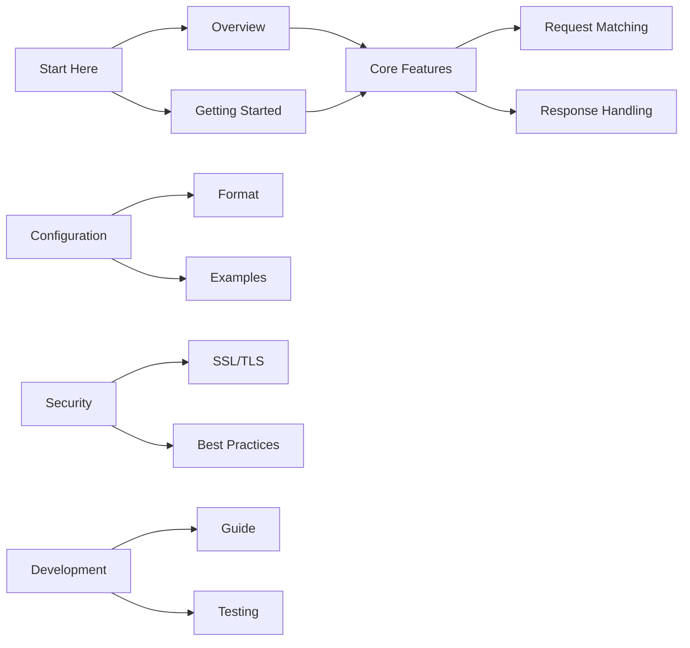

# GoStubby Documentation

Welcome to the GoStubby documentation. This comprehensive guide covers everything you need to know about using and contributing to GoStubby, a flexible and powerful mock server implementation in Go.

## Documentation Sections

### 📚 Getting Started
- [Project Overview](overview.md) - Introduction to GoStubby and its features
- [Getting Started Guide](getting-started.md) - Installation and basic usage
- [Quick Start Tutorial](getting-started.md#quick-start-tutorial) - Get up and running quickly

### 🔧 Core Features
- [Request Matching](core-features/request-matching.md) - Learn about URL templates and request validation
- [Response Handling](core-features/response-handling.md) - Configure and customize mock responses
- [Template System](core-features/response-handling.md#template-based-responses) - Use dynamic response templates

### ⚙️ Configuration
- [Configuration Format](configuration/format.md) - Detailed configuration options
- [Command Line Options](configuration/format.md#configuration-management) - Available CLI arguments
- [Examples](configuration/format.md#examples) - Common configuration patterns

### 🔒 Security
- [SSL/TLS Configuration](security/ssl-tls.md) - Secure your mock server
- [Certificate Management](security/ssl-tls.md#certificate-management) - Handle SSL certificates
- [Security Best Practices](security/ssl-tls.md#best-practices) - Recommended security settings

### 👩‍💻 Development
- [Development Guide](development/development-guide.md) - Contributing to GoStubby
- [Testing](development/development-guide.md#testing) - Running and writing tests
- [Code Style](development/development-guide.md#code-style) - Coding standards and guidelines

## Quick Navigation

## Features Overview

| Feature | Description | Documentation |
|---------|-------------|---------------|
| URL Templates | Dynamic URL path matching | [Request Matching](core-features/request-matching.md#url-path-templates) |
| Response Templates | Template-based responses | [Response Handling](core-features/response-handling.md#template-based-responses) |
| SSL/TLS Support | Secure HTTPS endpoints | [SSL/TLS Configuration](security/ssl-tls.md) |
| Multiple Configurations | Flexible config management | [Configuration Format](configuration/format.md#configuration-management) |

## Common Tasks

### Setting Up a Mock API
1. [Install GoStubby](getting-started.md#installation)
2. [Create configuration file](getting-started.md#quick-start-tutorial)
3. [Start the server](getting-started.md#start-the-server)

### Securing Your Server
1. [Generate certificates](security/ssl-tls.md#certificate-management)
2. [Configure HTTPS](security/ssl-tls.md#quick-start)
3. [Apply security best practices](security/ssl-tls.md#best-practices)

### Contributing
1. [Set up development environment](development/development-guide.md#development-environment-setup)
2. [Read coding guidelines](development/development-guide.md#code-style)
3. [Submit pull request](development/development-guide.md#contributing)

## Getting Help

- **Issues**: Report bugs or request features through [GitHub Issues](https://github.com/dev-shimada/GoStubby/issues)
- **Discussions**: Ask questions in [GitHub Discussions](https://github.com/dev-shimada/GoStubby/discussions)
- **Contributing**: Read our [Development Guide](development/development-guide.md) to start contributing

## Version Information

- Current Version: 1.0.0
- Go Version: ≥ 1.16
- License: MIT

For the latest updates, please check our [GitHub repository](https://github.com/dev-shimada/GoStubby).

---

*Read this documentation in other languages: [日本語](index.ja.md)*
