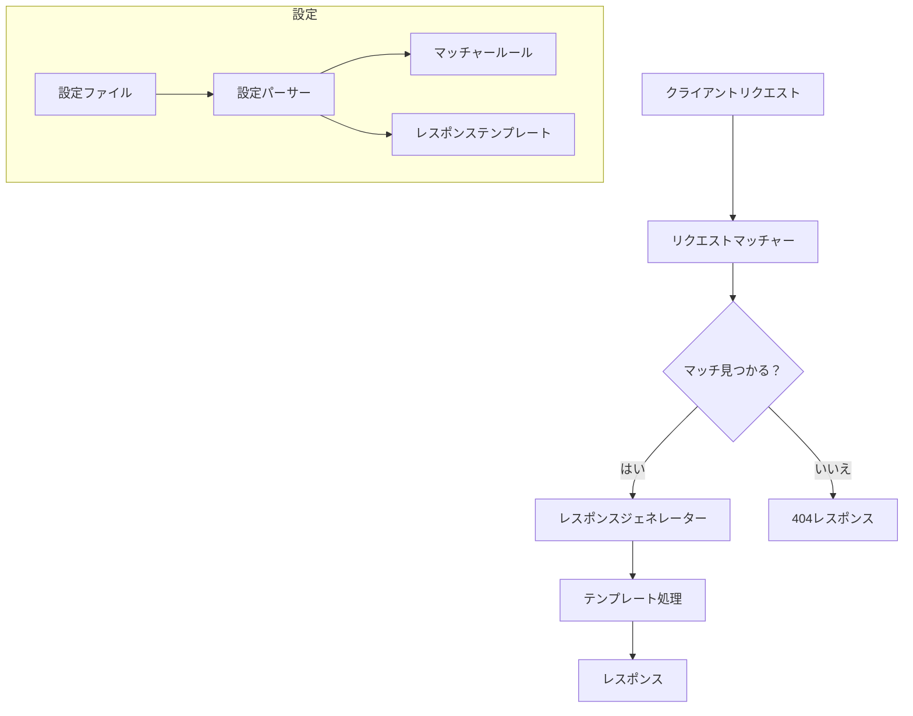

# GoStubby 概要

GoStubbyは、Goで実装された柔軟で強力なモックサーバーで、高度なリクエストマッチング機能とテンプレート化されたレスポンスを使用してモックエンドポイントを定義することができます。このドキュメントでは、プロジェクトの概要と機能について説明します。

## はじめに

GoStubbyを使用することで、開発者は以下のことが可能になります：
- 実際のバックエンドサービスに依存せずに開発を行う
- 様々なAPIシナリオに対するテスト
- APIのプロトタイピングとドキュメント作成
- 統合テストの実施

## 主要機能

### 柔軟なリクエストマッチング
- テンプレートを使用したURLパスマッチング（例：`/users/{id}`）
- 正規表現パターンマッチング
- クエリパラメータのバリデーション
- リクエストボディのバリデーション
- 複数のマッチングパターン：`equalTo`、`matches`、`doesNotMatch`、`contains`、`doesNotContain`

### 強力なレスポンス処理
- リクエストパラメータにアクセス可能なテンプレートベースのレスポンスボディ
- ファイルベースのレスポンスボディ
- カスタムHTTPステータスコード
- カスタムレスポンスヘッダー

### セキュリティ機能
- 完全なSSL/TLSサポート
- 設定可能なHTTPSエンドポイント
- TLS 1.2以上の強制
- セキュアな暗号スイートの設定

### 設定と使いやすさ
- JSONベースの設定
- 複数の設定ファイルのサポート
- 簡単なセットアップのためのコマンドラインインターフェース
- HTTPとHTTPSの同時サポート

## ユースケース

1. **開発環境**
   - フロントエンド開発中のAPIレスポンスのモック
   - 様々なAPIシナリオとエッジケースのシミュレーション
   - バックエンド依存なしでのオフライン作業

2. **テスト**
   - 再現可能なテストシナリオの作成
   - エラー条件とエッジケースのシミュレーション
   - 自動化された統合テスト

3. **APIプロトタイピング**
   - APIプロトタイプの迅速な作成
   - 実装前のAPI設計の反復
   - ドキュメント例の生成

4. **サービス仮想化**
   - 開発における依存サービスのシミュレーション
   - 安定したテスト環境の作成
   - 開発環境の複雑さの軽減

## アーキテクチャ概要

### コンポーネント

1. **リクエストマッチャー**
   - 受信したHTTP/HTTPSリクエストの処理
   - 設定されたマッチングルールの適用
   - 様々なマッチング戦略のサポート

2. **設定パーサー**
   - 設定ファイルの読み込みとバリデーション
   - 複数の設定ソースの管理
   - テンプレートの前処理の処理

3. **レスポンスジェネレーター**
   - レスポンステンプレートの処理
   - ファイルベースのレスポンスの処理
   - レスポンスヘッダーとステータスコードの管理

4. **セキュリティレイヤー**
   - SSL/TLS設定の管理
   - 証明書管理
   - セキュリティポリシーの適用

## 次のステップ

- [入門ガイド](getting-started.ja.md)でインストールと基本的な使用方法を確認
- [主要機能](core-features/request-matching.ja.md)で詳細な機能のドキュメントを確認
- [セキュリティガイド](security/ssl-tls.ja.md)でモックサーバーのセキュア化について確認
- [設定ガイド](configuration/format.ja.md)で高度な設定オプションを確認
