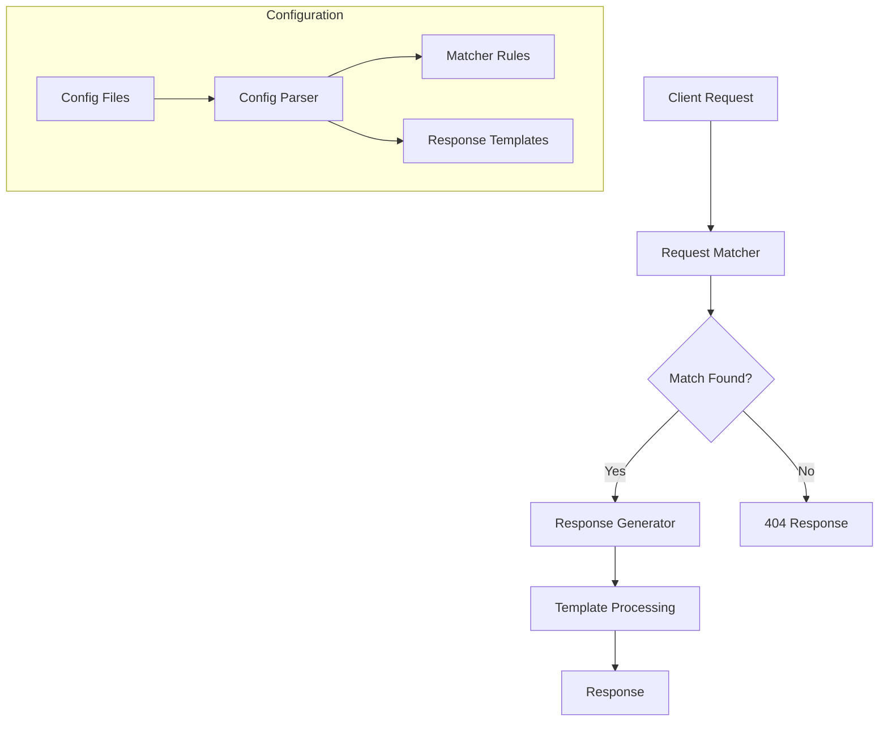

# GoStubby Overview

GoStubby is a flexible and powerful mock server implementation written in Go, designed to simplify API mocking and testing. This document provides a high-level overview of the project and its capabilities.

## Introduction

GoStubby allows developers to define mock endpoints with advanced request matching capabilities and templated responses. It's particularly useful for:
- Development without depending on actual backend services
- Testing applications against various API scenarios
- API prototyping and documentation
- Integration testing

## Key Features

### Flexible Request Matching
- URL path matching with templates (e.g., `/users/{id}`)
- Regular expression pattern matching
- Query parameter validation
- Request body validation
- Multiple matching patterns: `equalTo`, `matches`, `doesNotMatch`, `contains`, `doesNotContain`

### Powerful Response Handling
- Template-based response bodies with access to request parameters
- File-based response bodies
- Custom HTTP status codes
- Custom response headers

### Security Features
- Full SSL/TLS support
- Configurable HTTPS endpoints
- TLS 1.2+ enforcement
- Secure cipher suite configuration

### Configuration and Usability
- JSON-based configuration
- Support for multiple configuration files
- Command-line interface for easy setup
- Simultaneous HTTP/HTTPS support

## Use Cases

1. **Development Environment**
   - Mock API responses during frontend development
   - Simulate various API scenarios and edge cases
   - Work offline without backend dependencies

2. **Testing**
   - Create reproducible test scenarios
   - Simulate error conditions and edge cases
   - Automated integration testing

3. **API Prototyping**
   - Quickly create API prototypes
   - Iterate on API design before implementation
   - Generate documentation examples

4. **Service Virtualization**
   - Simulate dependent services in development
   - Create stable test environments
   - Reduce development environment complexity

## Architecture Overview

### Components

1. **Request Matcher**
   - Processes incoming HTTP/HTTPS requests
   - Applies configured matching rules
   - Supports various matching strategies

2. **Configuration Parser**
   - Loads and validates configuration files
   - Manages multiple configuration sources
   - Handles template preprocessing

3. **Response Generator**
   - Processes response templates
   - Handles file-based responses
   - Manages response headers and status codes

4. **Security Layer**
   - Manages SSL/TLS configurations
   - Handles certificate management
   - Enforces security policies

## Next Steps

- Read the [Getting Started Guide](getting-started.md) for installation and basic usage
- Explore [Core Features](core-features/request-matching.md) for detailed feature documentation
- Check the [Security Guide](security/ssl-tls.md) for securing your mock server
- Review the [Configuration Guide](configuration/format.md) for advanced setup options
