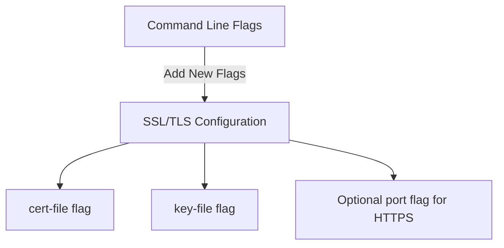
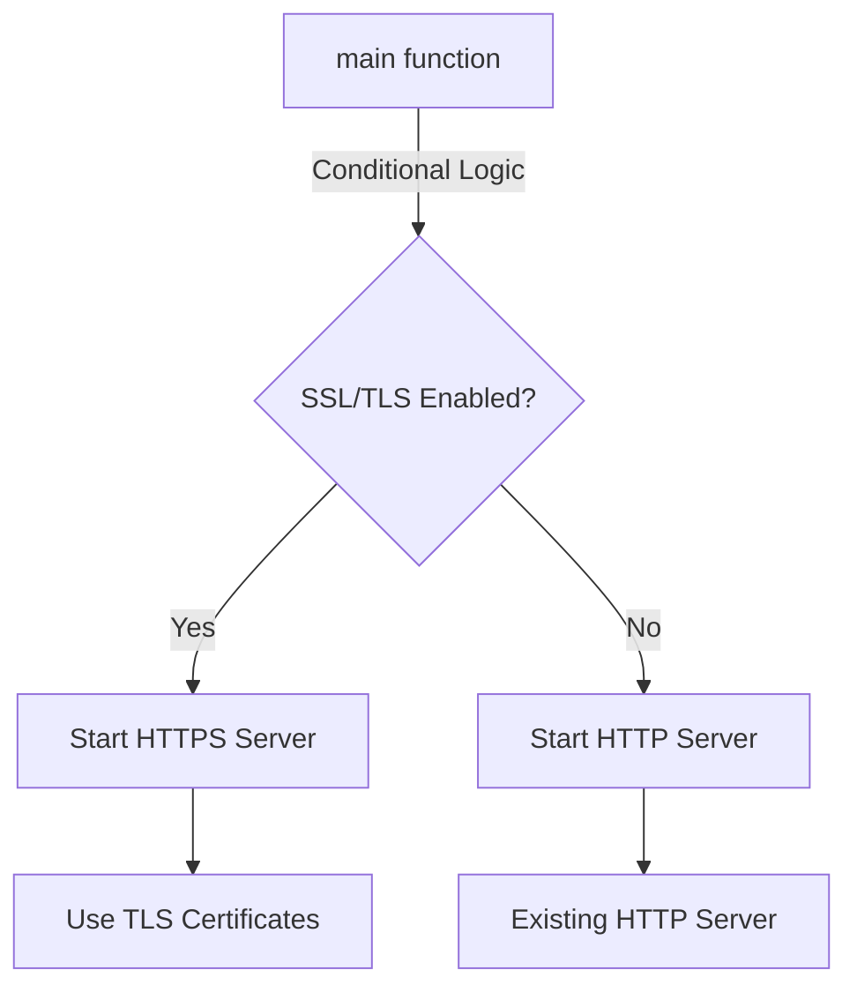
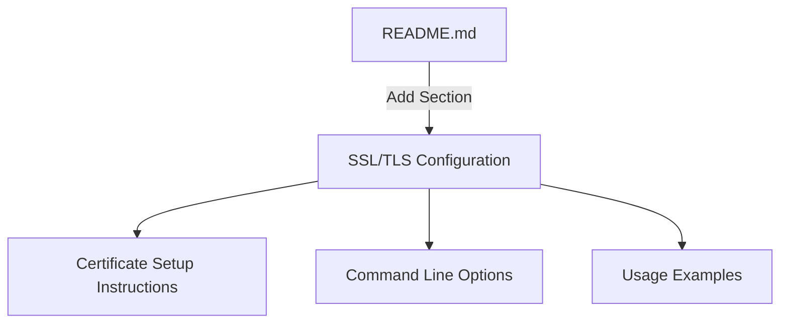

# SSL/TLS Implementation Plan for GoStubby

## 1. Certificate Configuration

### New Command Line Flags
- `--cert` or `-t`: Path to SSL/TLS certificate file
- `--key` or `-k`: Path to SSL/TLS private key file
- `--https-port` or `-s`: Port for HTTPS (default: 8443)

## 2. Server Implementation Changes

### Implementation Tasks
1. Add configuration struct for SSL/TLS settings
2. Modify server initialization to support both HTTP and HTTPS
3. Implement conditional server startup based on certificate presence
4. Add graceful shutdown support for both servers
5. Update error handling for certificate loading

## 3. Documentation Updates

### Documentation Tasks
1. Add SSL/TLS section to README.md
   - Certificate configuration
   - Self-signed certificate generation guide
   - HTTPS usage examples
2. Update command-line options documentation
3. Add examples for running with HTTPS enabled
4. Document simultaneous HTTP/HTTPS support

## Technical Considerations

1. Certificate Handling:
   - Validate certificate files exist and are readable
   - Support both PEM and DER formats
   - Proper error messaging for certificate issues

2. Security:
   - Enforce minimum TLS version (TLS 1.2+)
   - Configure secure cipher suites
   - Add security headers for HTTPS responses

3. Performance:
   - Efficient certificate loading
   - Proper connection handling
   - Resource cleanup on shutdown

## Implementation Sequence

1. Phase 1: Basic SSL/TLS Support
   - Add command line flags
   - Implement basic HTTPS server
   - Update documentation

2. Phase 2: Enhanced Features
   - Add security headers
   - Implement TLS version control
   - Add cipher suite configuration

3. Phase 3: Testing and Validation
   - Add SSL/TLS unit tests
   - Create integration tests
   - Security testing
